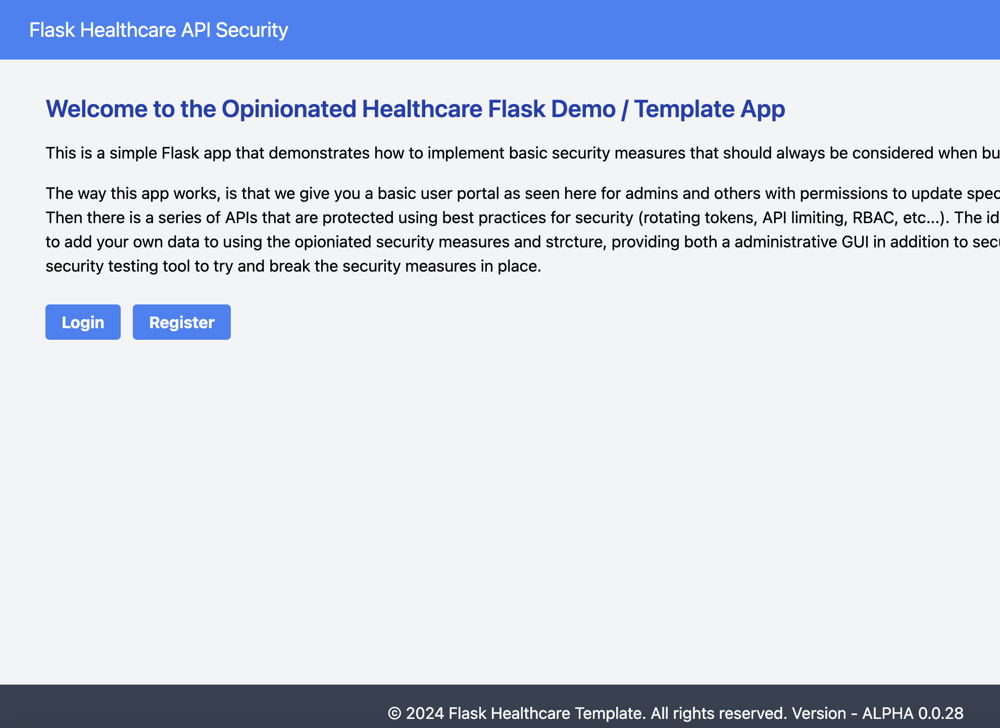
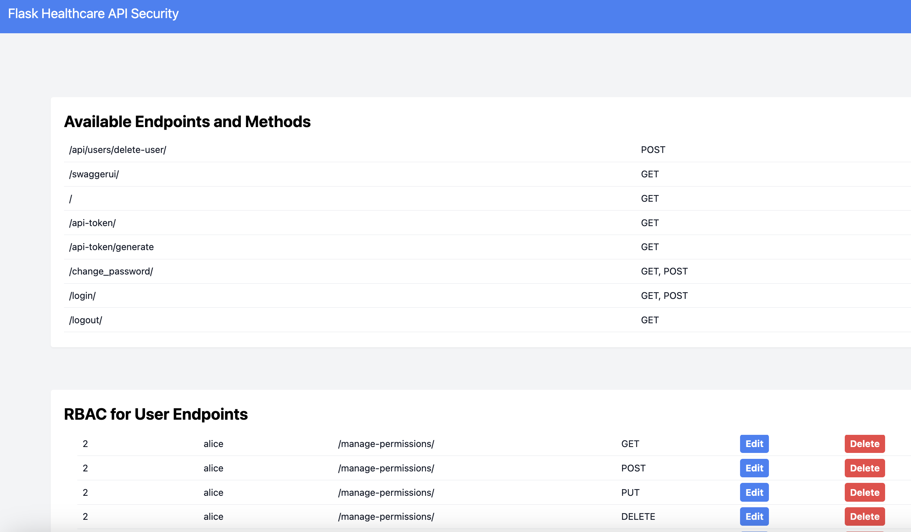
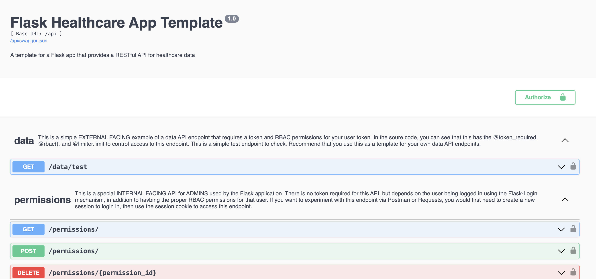

# A Flask API Security Focused Template for Healthcare

<!-- create div component with 3 images -->
<div style="display: flex; flex-wrap: wrap; gap: 10px;">
    <div style="flex: 1 0 40%; max-width: 40%;">
        
    </div>
    <div style="flex: 1 0 40%; max-width: 40%;">
        
    </div>
    <div style="flex: 1 0 40%; max-width: 40%;">
        
    </div>
    <!-- Add another image here if you want a complete 2x2 grid -->
</div>

# What is it? 

This is a Flask API Template that can be HIPAA / HITRUST compliant. It is for demonstration pursposes and learning, showcasing the flexibility of Flask. The template for this flask ask can be found in the `/healthcare-template-app` directory.

I decided to make this repo to first help myself better understand how to implement common required security features for HIPAA / HITRUST compliance, and then second to help others who are looking to build and learn.

The app application takes some inspirtation from the Next.js framework, if you are familiar with it, they have the idea of having a `pages` folder that contains all of the relevant code for the HTML template pages. Even though this is a API focused template, it includes a set of administrative pages with a very basic user interfaced styled with Tailwind. Then most importantly, the `api` folder contains all of the relevant code for the API endpoints. We have utilized Flask Blueprints for the HTML pages, and Flask RestX for the API endpoints. 

The app is designed to become HIPAA / HITRUST compliant, it is not currently, and never fully will. This is because: 

1. Many of the requirements to become HIPAA/HITRUST compliant, go beyond technology, and involve human training. It is impossible to make a technology fully compliant without the human element. This is why the app is a template, and not a final product.

2. In addition, This does not address the infastructure requirements for HIPAA / HITRUST compliance, such as the need for a BAA with your cloud provider, disaster recovery plan, monitoring and logging of the instrastructure, required encryption, etc. Many of the major cloud providers have services that can help with this, but it is up to you to configure and implement them properly. 

3. Lastly, this is a flask app that was built for simplicity, but still has some advanced features. It is not meant to be a full production ready app, but rather a starting point for building a more complex application. It is up to you to determine what you want to keep, remove, or modify.  

## Overall Features
- Security first approach (see HIPAA / HITRUST items covered below)
- Provide admin/user gui for managing RBAC level permissions and general user management
- Three different testing environments: DEV, STAGING, PROD
- Dockerized for easy deployment in production environments 

## Security Features Related to HIPAA / HITRUST covered:

1. **Role based access controls (RBAC**) - prevents unauthorized access to PHI
    - With simple dedicated GUI for admin to manage roles-permissions, and users 
2. **2-Factor Authentication** - prevents unauthorized access to PHI
    - Currently set to Google Authenticators
3. **Session Timeout** - prevents unauthorized access to PHI
    - Currently set to 5 minutes
4. **Session Security**:
    - Session cookie is only allowed over HTTPS (SESSION_COOKIE_SECURE)
    - Session cookie is only allowed to be accessed by the server (SESSION_COOKIE_HTTPONLY)
    - Session cookie is only allowd by the server that set it (SESSION_COOKIE_SAMESITE)
5. **Minimum password length and complexity** - prevents weak passwords
    - Currently set to 8 characters, 1 uppercase, 1 lowercase, 1 number, 1 special character
6. **Account lockout** - prevents brute force attacks
    - Currently set to 5 attempts, lockout for `15 minutes`
7. **Login audit trail** - tracks who is accessing PHI
    - Captures IP address, username, and timestamp
    - Currently part of `User` model table
8. **User activity audit trail** - tracks what users are doing with PHI
    - Captures all endpoints accessed, method, and timestamp
    - Currently in datatable called `UserActivityLog`
9. **Password expiration** - prevents unauthorized access to PHI 
    - Currently set to 90 days
10. **Overall application monitoring** - 
    - Currently with Sentry.io
    - Have built in basic RegEx rules to reduce/prevent PHI (or PII) from being logged in Sentry
11. **Rotating API tokens** - prevents unauthorized access to PHI
    - Currently set to 7 days
    - The config is found in the DB model: `APIToken`
12. **API limiting** 
    - Each end up currently has a set limit of 1 request per second
    - Can individually set limits for each endpoint
13. **Content Security Policy (CSP)** - prevents XSS attacks
    - Currently set to `default-src 'self'` 
    - Can be modified in the `util/config/loader.py` file
14. **Pre-deploy checks** 
    - `predeploy.codechecks.py` can be run before running the app to check for any potential issues: 
        - *RUFF* for linting/code quality 
        - *SAFETY* for security vulnerabilities in dependencies
        - *BANDIT* for security vulnerabilities in the code
15. .....and more coming soon

## Different Environments 
Currently has three different environments: 1. DEV, 2. PROD, 3. TEST. Each of these environments has a different configuration file (configDev.yaml, configStaging.yaml, configProd.yaml). The `.env` file is used to determine which environment the app is in. Key differences: 

- **DEV**: 
    - All security features are turned off
    - The app is in debug mode
    - The app is not using HTTPS
    - 2 factor is off for testing purposes

- **STAGING**: 
    - All security features are turned on
    - The app is in debug mode
    - The app is using a local self-signed HTTPS (e.g., just agree to the warning message to proceed)
    - 2 factor is off for testing purposes

- **PROD**:
    - All security features are turned on
    - The app is not in debug mode
    - The app is using HTTPS
    - 2 factor is on

## Quick start

Next is a quick start guide for getting the app quickly running in the development environment. 

### Local: DEV:

<div>
    <a href="https://www.loom.com/share/a92cf2e501fb44e9947da4c2cef1aac1">
      <p>Flask API Healthcare Focus Template on Security (V1 Dev How to) - Watch Video</p>
    </a>
    <a href="https://www.loom.com/share/a92cf2e501fb44e9947da4c2cef1aac1">
      
    </a>
</div>

- Step 1: Inside the route folder of the project where the requirements.txt file is located
    - `python3 -m venv venv` or `python -m venv venv`
    - `source venv/bin/activate`
    - `pip install -r requirements.txt`
- Step 2: Rename `.env.template` to `.env` file, and:
    - Set the ENVIRONMENT to `DEV` 
    - Create a redis cloud account and get the URL for the redis server
        - Add the redis URL to the `.env` file
    - Create a sentry account and get the DSN key
        - Add the sentry DSN key to the `.env` file
    - Create a SECRET_KEY for the app
        - Add the secret key to the `.env` file
    - Either keep the SQLALCHEMY_DATABASE_URI as is, or change it to your preferred database
- Step 3: If you want to change anything within the dev environment, open up `healthcare-template-app/configDev.yaml` and make your changes
- Step 4: Change director to current working directory or CD into `healthcare-template-app` then run:
    - `python3 predeploy.init_db.py` or `predeploy.init_db.py` to initialize the database
        - this is manditory to run before starting the app
    - If you want to run some pre-deployment checks, run `python3 predeploy.codechecks.py` or `python predeploy.codechecks.py`
        - This is not manditory, but recommended beforing deploying the app to a staging or production environmemnt 
        - It will output suggested changes to add inside `predeploy_checks/outout` folder for you to review
    - `python3 app.py` or `python app.py` to start the app on `http:\\localhost:5005`

### Local: STAGING: 
- Step 1: Same as DEV env 
- Step 2: Rename `.env.template` to `.env` file, set ENVIRONMENT to `STAGING`
- Step 3: Create locally signed SSL certificates
    - CD into the `healthcare-template-app/certificate` folder
    - In your terminal: `openssl req -x509 -newkey rsa:4096 -nodes -out cert.pem -keyout key.pem -days 365` 
    - This should result in a `cert.pem` and `key.pem` file which are ignored by git
- Step 4: If you want to change anything within the dev environment, open up `healthcare-template-app/configStaging.yaml` and make your changes
- Step 5: Change director to current working directory or CD into `healthcare-template-app` then run:
    - `python3 init_db.py` or `python init_db.py` to initialize the database
    - `python3 app.py` or `python app.py` to start the app on `https:\\localhost:5005`

### Remote: PROD: with GCP Cloud Run: 
- Step 1: Recommend using docker for production and first testing in dev and staging environments 
- Step 2: Rename `.env.template` to `.env` file, set ENVIRONMENT to `PROD`
- Step 3: Update `BASE_URL` in `healthcare-template-app/configProd.yaml` to the correct URL of your production server
- Step 4: Build the docker image, navigate in terminal to root folder of the project where `Dockerfile` is located and run: 
    - `docker buildx build --platform linux/amd64 -f Dockerfile.Prod -t flaskhealth .` 
    - `docker run -p 5005:5005 flaskhealth`
    - Make sure it works as expected
- Step 5: Deploy the docker image to docker hub or your preferred container registry
    - `docker tag flaskhealth:latest <your-docker-username>/flaskhealth:latest`
    - `docker push <your-docker-username>/flaskhealth:latest`
- Step 6: Deploy the docker image to your production server
    - Example with Google Cloud Run service with GUI:  
        - Login to Google Cloud Console
        - Navigate to Cloud Run
        - Click on `Create Service`
        - Select the container registry where the image is located
        - Select the image
        - Set the port to 5005
        - Set the environment variables (copy from `.env` file)
        - Click `Create` and wait for the service to deploy


---

## To do
1) Add in unit testing (pytest) to predeploy checks


## HIPAA:

[HITRUST](https://hitrustalliance.net/csf-license-agreement/) control v11.2.0

## FROM Excel Sheet HITRUST CSF v11.2.0 Cross Reference List

In total from security, privacy, and breach there are 137 (?) total unique HITRUST controls

### Unique HITRUST controls relevant for HIPAA Security Rule:
- 659 total control references for security rule
- 133 unique controls:

```
00.a Information Security Management Program	22
01.a Access Control Policy	15
01.b User Registration	9
01.c Privilege Management	12
01.d User Password Management	1
01.e Review of User Access Rights	2
01.f Password Use	1
01.g Unattended User Equipment	3
01.h Clear Desk and Clear Screen Policy	1
01.i Policy on the Use of Network Services	4
01.j User Authentication for External Connections	2
01.k Equipment Identification in Networks	2
01.l Remote Diagnostic and Configuration Port Protection	6
01.m Segregation in Networks	3
01.n Network Connection Control	4
01.o Network Routing Control	1
01.p Secure Log-on Procedures	3
01.q User Identification and Authentication	4
01.r Password Management System	1
01.t Session Time-out	1
01.u Limitation of Connection Time	1
01.v Information Access Restriction	7
01.w Sensitive System Isolation	1
01.x Mobile Computing and Communications	3
01.y Teleworking	5
02.a Roles and Responsibilities	8
02.b Screening	6
02.c Terms and Conditions of Employment	5
02.d Management Responsibilities	10
02.e Information Security Awareness, Education, and Training	9
02.f Disciplinary Process	4
02.g Termination or Change Responsibilities	1
02.h Return of Assets	1
02.i Removal of Access Rights	8
03.a Risk Management Program Development	5
03.b Performing Risk Assessments	7
03.c Risk Mitigation	3
03.d Risk Evaluation	1
04.a Information Security Policy Document	5
04.b Review of the Information Security Policy	4
05.a Management Commitment to Information Security	8
05.b Information Security Coordination	10
05.c Allocation of Information Security Responsibilities	4
05.d Authorization Process for Information Assets and Facilities	3
05.f Contact with Authorities	4
05.g Contact with Special Interest Groups	2
05.h Independent Review of Information Security	7
05.i Identification of Risks Related to External Parties	3
05.j Addressing Security When Dealing with Customers	4
05.k Addressing Security in Third Party Agreements	9
06.a Identification of Applicable Legislation	3
06.c Protection of Organizational Records	17
06.d Data Protection and Privacy of Covered Information	20
06.e Prevention of Misuse of Information Assets	4
06.f Regulation of Cryptographic Controls	4
06.g Compliance with Security Policies and Standards	3
06.h Technical Compliance Checking	5
06.i Information Systems Audit Controls	7
07.a Inventory of Assets	5
07.b Ownership of Assets	1
07.c Acceptable Use of Assets	1
07.d Classification Guidelines	5
08.a Physical Security Perimeter	5
08.b Physical Entry Controls	13
08.c Securing Offices, Rooms, and Facilities	3
08.e Working in Secure Areas	2
08.g Equipment Siting and Protection	4
08.i Cabling Security	3
08.j Equipment Maintenance	10
08.k Security of Equipment Off-Premises	2
08.l Secure Disposal or Re-Use of Equipment	5
08.m Removal of Property	1
09.a Documented Operations Procedures	1
09.aa Audit Logging	11
09.ab Monitoring System Use	15
09.ac Protection of Log Information	3
09.ad Administrator and Operator Logs	1
09.b Change Management	8
09.c Segregation of Duties	5
09.e Service Delivery	6
09.f Monitoring and Review of Third Party Services	5
09.h Capacity Management	2
09.i System Acceptance	3
09.j Controls Against Malicious Code	1
09.k Controls Against Mobile Code	1
09.l Back-up	7
09.m Network Controls	10
09.n Security of Network Services	5
09.o Management of Removable Media	7
09.p Disposal of Media	4
09.q Information Handling Procedures	11
09.r Security of System Documentation	1
09.s Information Exchange Policies and Procedures	9
09.t Exchange Agreements	1
09.u Physical Media in Transit	8
09.v Electronic Messaging	4
09.w Interconnected Business Information Systems	1
09.x Electronic Commerce Services	4
09.y On-line Transactions	4
09.z Publicly Available Information	3
10.a Security Requirements Analysis and Specification	8
10.b Input Data Validation	3
10.c Control of Internal Processing	11
10.d Message Integrity	1
10.f Policy on the Use of Cryptographic Controls	3
10.h Control of Operational Software	6
10.j Access Control to Program Source Code	1
10.k Change Control Procedures	4
10.m Control of Technical Vulnerabilities	7
11.a Reporting Information Security Events	8
11.b Reporting Security Weaknesses	3
11.c Responsibilities and Procedures	10
11.d Learning from Information Security Incidents	6
11.e Collection of Evidence	4
12.a Including Information Security in the Business Continuity Management Process	7
12.b Business Continuity and Risk Assessment	4
12.c Developing and Implementing Continuity Plans Including Information Security	14
12.d Business Continuity Planning Framework	4
12.e Testing, Maintaining and Re-Assessing Business Continuity Plans	5
13.a Privacy Notice	1
13.d Consent	1
13.e Choice	1
13.f Principle Access	5
13.j Data Minimization	1
13.k Use and Disclosure	13
13.l Retention and Disposal	2
13.p Governance	1
13.q Privacy and Impact Assessment	2
13.r Privacy Requirements for Contractors and Processors	12
13.t Privacy Protection Awareness and Training	2
```


### Unique HITRUST controls relevant for HIPAA Privacy Rule:
- 970 total control references for security rule
- 54 unique controls:

```
00.a Information Security Management Program	8
01.a Access Control Policy	1
01.c Privilege Management	2
01.w Sensitive System Isolation	1
02.a Roles and Responsibilities	1
02.b Screening	2
02.c Terms and Conditions of Employment	1
02.d Management Responsibilities	1
02.e Information Security Awareness, Education, and Training	6
02.f Disciplinary Process	3
02.i Removal of Access Rights	1
03.c Risk Mitigation	1
04.a Information Security Policy Document	2
04.b Review of the Information Security Policy	12
05.d Authorization Process for Information Assets and Facilities	1
05.e Confidentiality Agreements	2
05.f Contact with Authorities	1
05.i Identification of Risks Related to External Parties	2
05.j Addressing Security When Dealing with Customers	13
05.k Addressing Security in Third Party Agreements	3
06.a Identification of Applicable Legislation	5
06.c Protection of Organizational Records	36
06.d Data Protection and Privacy of Covered Information	18
06.e Prevention of Misuse of Information Assets	3
08.b Physical Entry Controls	1
09.aa Audit Logging	5
09.ab Monitoring System Use	1
09.c Segregation of Duties	1
09.e Service Delivery	2
09.n Security of Network Services	1
09.s Information Exchange Policies and Procedures	2
09.t Exchange Agreements	2
09.u Physical Media in Transit	2
09.x Electronic Commerce Services	1
10.a Security Requirements Analysis and Specification	2
10.c Control of Internal Processing	1
10.i Protection of System Test Data	1
11.a Reporting Information Security Events	10
11.e Collection of Evidence	1
13.a Privacy Notice	81
13.b Openness and Transparency	57
13.c Accounting of Disclosures	47
13.d Consent	56
13.e Choice	61
13.f Principle Access	97
13.j Data Minimization	75
13.k Use and Disclosure	277
13.l Retention and Disposal	5
13.n Participation and Redress	10
13.o Complaint Management	4
13.q Privacy and Impact Assessment	1
13.r Privacy Requirements for Contractors and Processors	30
13.t Privacy Protection Awareness and Training	8
13.u Privacy Protection Reporting	1
```

### Unique HITRUST controls relevant for HIPAA Breach Notification Rule:
- 34 total control references for security rule
- 5 unique controls:

```
03.b Performing Risk Assessments	1
06.c Protection of Organizational Records	2
11.a Reporting Information Security Events	28
11.c Responsibilities and Procedures	1
13.e Choice	1
```